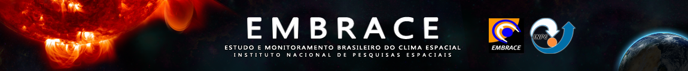

# Briefing Space Weather -- 2022/05/23 
 # Sun 
 ## Responsible: José Cecatto 

05/16 – M2 flare and radio blackout; Fast wind stream (<= 550 km/s); 1 CME c.h.c. toward the Earth; 
05/17 – M1 flare; Fast wind stream (<= 600 km/s); 7 CME c.h.c. toward the Earth; 
05/18 – M1 flare; Fast wind stream (<= 550 km/s); 3 CME c.h.c. toward the Earth; 
05/19 – 3 M-Flares (2M1, M6); Fast wind stream (<= 550 km/s); 7 CME c.h.c. toward the Earth; 
05/20 – M3 flare; M1 flare; Fast wind stream (<= 600 km/s); 2 CME c.h.c. toward the Earth; 
05/21 – No flare (M/X); Fast wind stream (<= 550 km/s); 8 CME c.h.c. toward the Earth *; 
05/22 – No flare (M/X); Fast wind stream (<= 550 km/s); 9 CME c.h.c. toward the Earth; 
05/23 – No flare (M/X); Fast wind stream (<= 550 km/s); 3 CME c.h.c. toward the Earth; 
Prev.: Fast wind stream up to May 24; for the next 2 days relatively low (40% M, 05% X) probability of M / X flares; 
also, occasionally other CME can present component toward the Earth. 
c.h.c. – can have a component; * partial halo; ** halo# Sun 
 ## Responsible: Douglas Silva 

* WSA-ENLIL (CME 2022-05-17T05:48Z, 2022-05-17T06:48Z)
	 * The simulation results indicate that the flanks of combined Coronal Mass Ejections will reach the DSCOVR mission between 2022-05-19T22:30Z and 2022-05-20T12:30Z.
* WSA-ENLIL (CME 2022-05-17T09:23Z )
	 * The simulation results indicate that the flank of CME will reach the DSCOVR mission between 2022-05-21T10:00Z e 2022-05-22T00:00Z. 

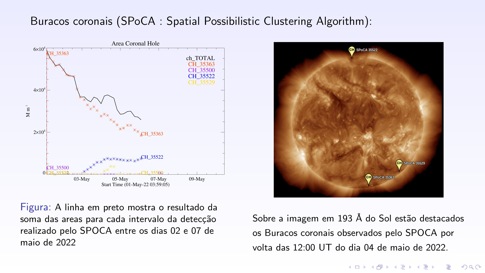
                        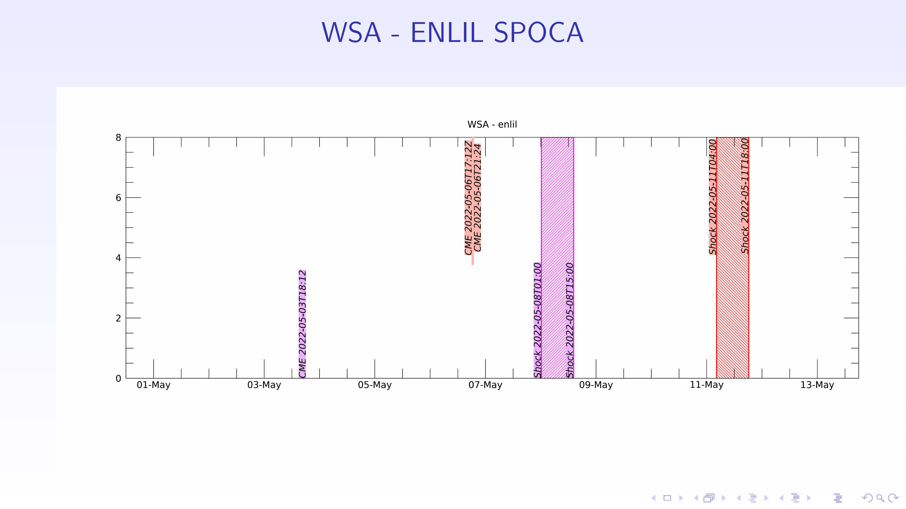
                        # ULF Waves 
 ## Responsible: José Paulo Marchezi 
 
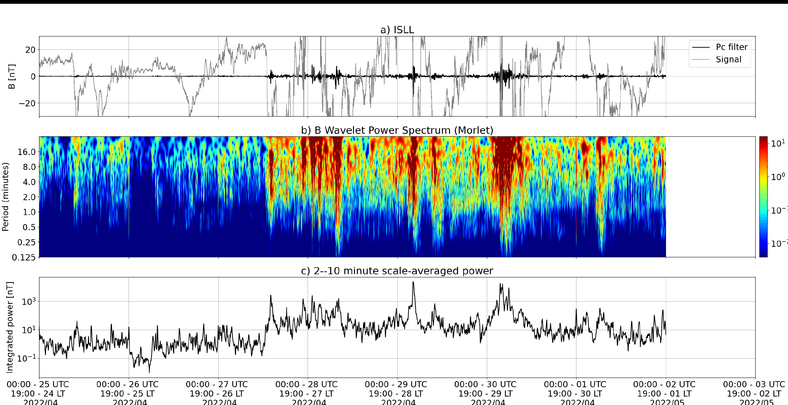*a) signal of the total magnetic 
                              field measured in the ISLL Station of the CARISMA 
                              network in gray, together with the fluctuation in the 
                              range of Pc5 in black. b) Wavelet power spectrum of the 
                              filtered signal. c) Average spectral power in the ranges 
                              from 2 to 10 minutes (ULF waves).*
                        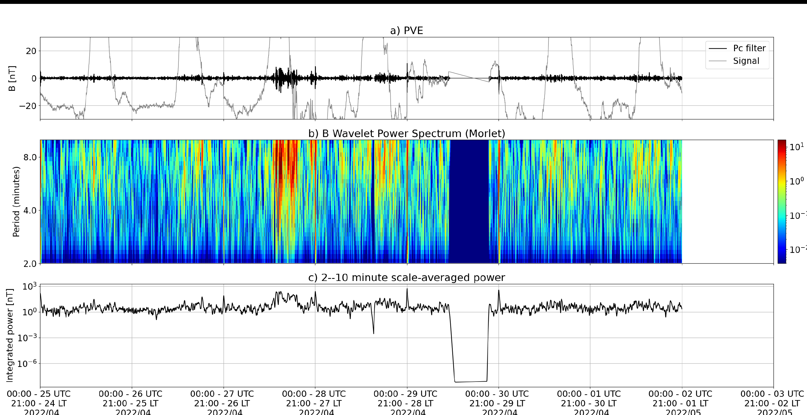*a) signal of the total magnetic field 
                              measured in the EMBRACE network in gray, together with
                               the fluctuation in the range of Pc5 in black. b)
                                Wavelet power spectrum of the filtered signal. c) 
                                Average spectral power in the ranges from 2 to 10
                                 minutes (ULF waves).*
                        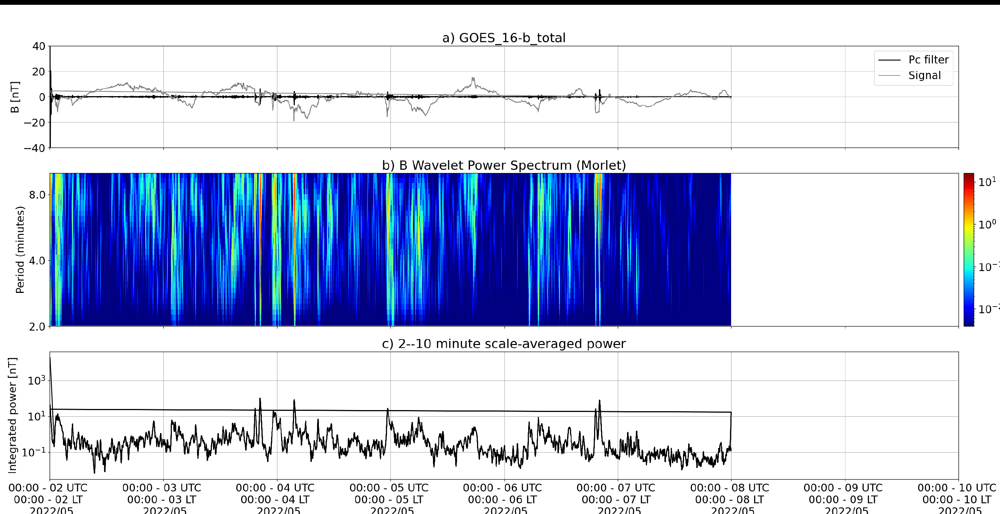*a) signal of the total magnetic field 
                              measured by the GOES 16 satellite, together with the 
                              fluctuation in the range of Pc5 in black. b) Wavelet 
                              power spectrum of the filtered signal. c) Average 
                              spectral power in the ranges from 2 to 10 minutes 
                              (ULF waves).*
                        The ULF wave activity starts on May 16, presents two short peaks before
12:00 UT and after noon it remains at the lowest power with characteristics
of continuous geomagnetic pulsations. On the 17th, around 11:00 UT there is
a new signal increase, with continuous characteristics, possibly related to an
increase in the solar wind speed. Between the 18th and 19th, activity
remains reduced, with some peaks, mainly at high latitudes, also recorded
by the GOES satellite. The disturbances increase on May 20, also recorded at
low latitude, by EMBRACE magnetometers.
Summary
10/10
The ULF wave activity starts on May 16, presents two short peaks before 12:00 UT and after noon it remains at the lowest power with characteristics of continuous geomagnetic pulsations. On the 17th, around 11:00 UT there is a new signal increase, with continuous characteristics, possibly related to an increase in the solar wind speed. Between the 18th and 19th, activity remains reduced, with some peaks, mainly at high latitudes, also recorded by the GOES satellite. The disturbances increase on May 20, also recorded at low latitude, by EMBRACE magnetometers.# Ondas EMIC 
 ## Responsável: Claudia Medeiros 
 

                        # Geomagnetism 
 ## Responsible: Livia Riveiro Alves 
 
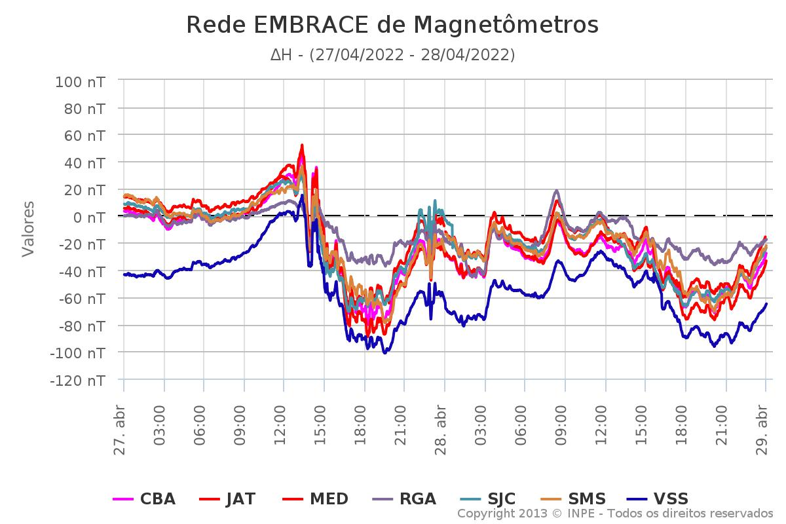
                        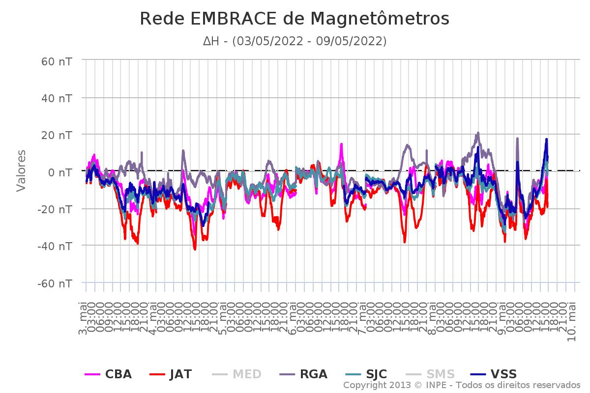
                        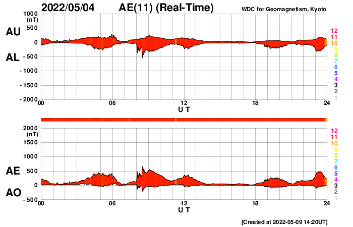
                        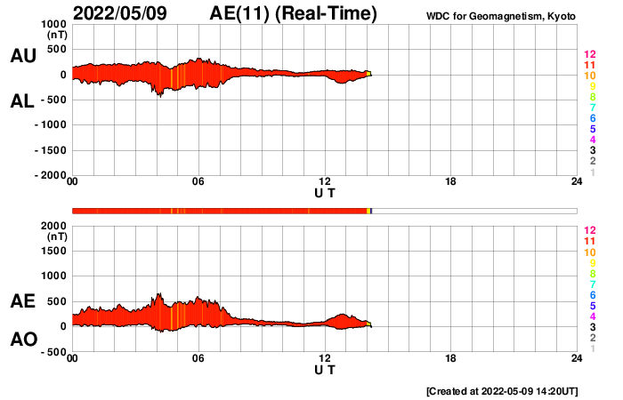
                        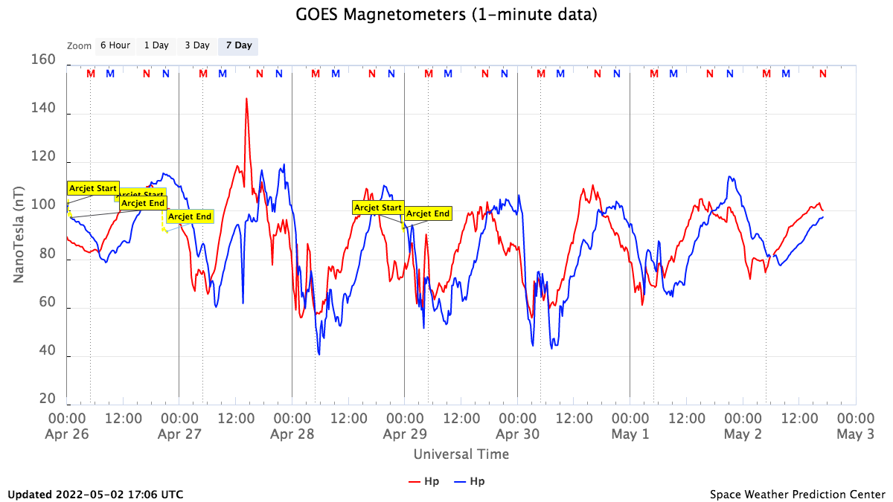
                        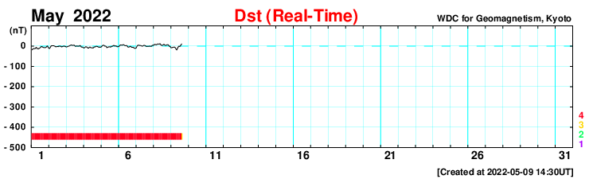
                        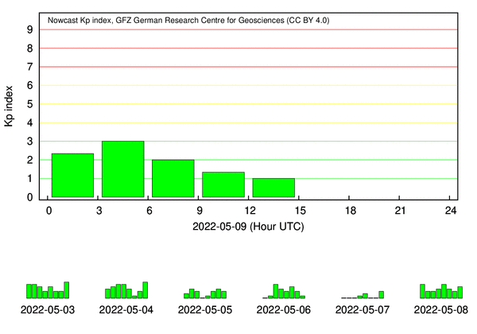
                        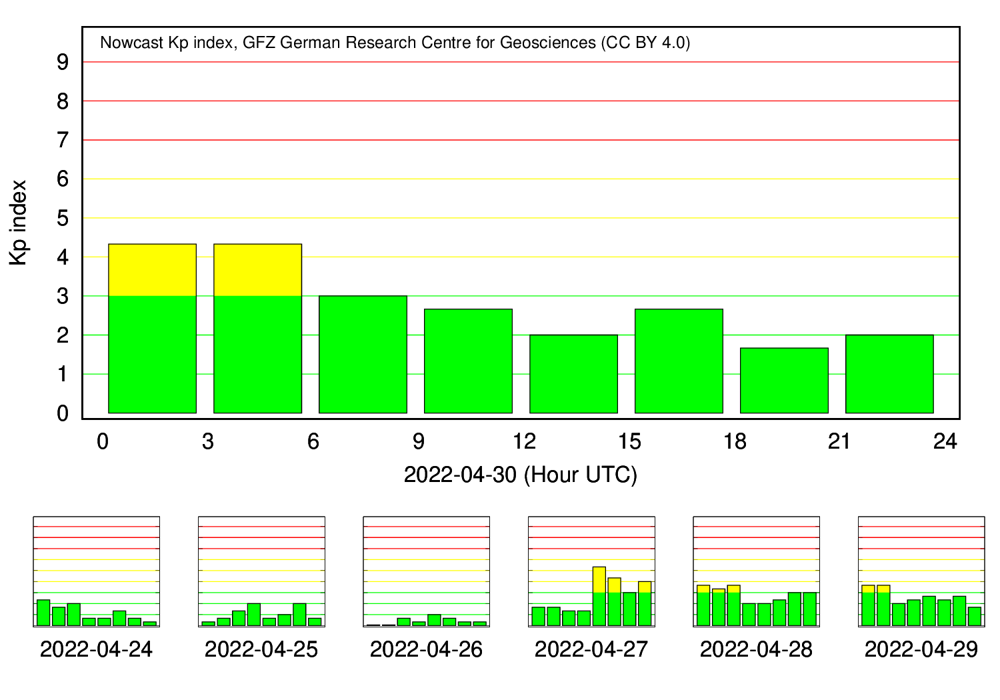
                        * In the week of 05/17 to 05/23, the following events related to geomagnetic activity stand out:
* Data from the Embrace magnetometer network showed instabilities throughout the period, no significant events in the last period
* Geomagnetic activity was unstable throughout the AE index, with the Dst index oscillating around zero. Highest Kp of the week was 3+
*  The auroral activity was slightly intensified on the 20th and 22th of May.
# Ionosphere 
 ## Responsible: Laysa Resende 
 
**Boa Vista: **

* There were not occurred spread F on day 16.
* The Es layers reached scale 4 on days 18 and 21.

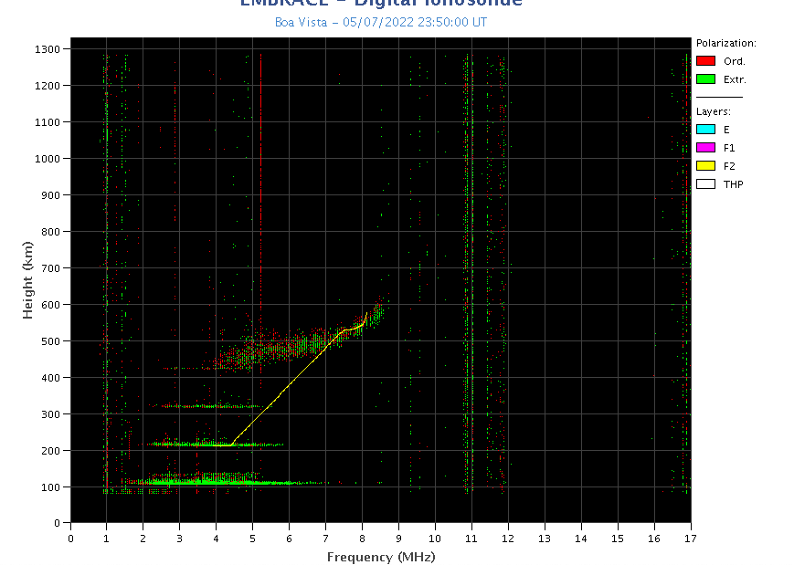
                        
**Cachoeira Paulista:**

* There were spread F on day 18.
* The Es layers reached scale 3 on day 19. 

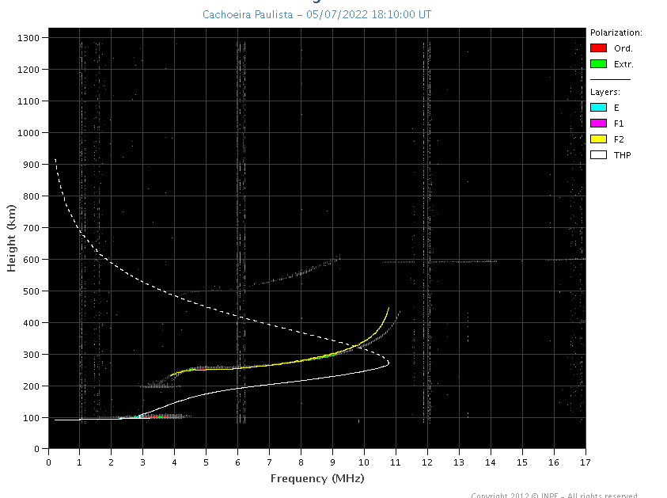
                        
**São Luís: **

* There were spread F during all days in this week.
* The Es layers reached scale 4 on day 21. 
* There was blackout on day 19. 

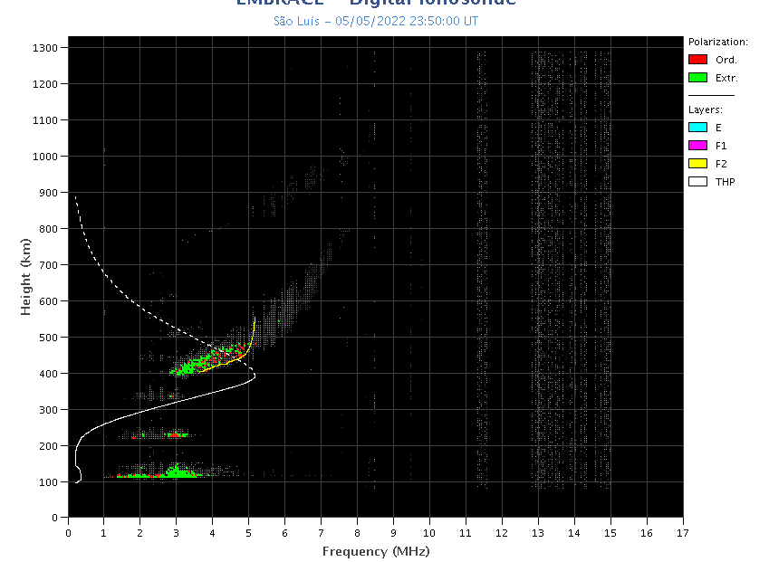
                        
# Scintilation 
 ## Responsible: Siomel Savio Odriozola 
 
In this report on the S4 scintillation index, data from SLMA in São Luiz/MA, STSN 
in Sinop/MG, STNT in Natal/RN and SJCE in São José dos Campos/SP are 
presented. The S4 index tracks the presence of irregularities in the ionosphere 
having a spatial scale ~ 360 m. 
The SLMA, STSN and SJCE stations did not show relevant values of the S4 index 
throughout the week. The STSN station in Sinop, presented, at the same time on 
the 18th and 19th of May, S4 values close to 0.7. Figure 1 shows the map with 
satellites recorded by STSN in the time interval between 1200(UT) to 1500(UT) 
on 05/19 (top panel) and between 1130(UT) to 1500(UT) 05/20 (bottom panel) 
and with S4 values > 0.2. The same satellite (G9) appears to be solely 
responsible for the high values recorded in this time interval, which indicates an 
extra geophysical cause in the high values of S4 in Sinop. 
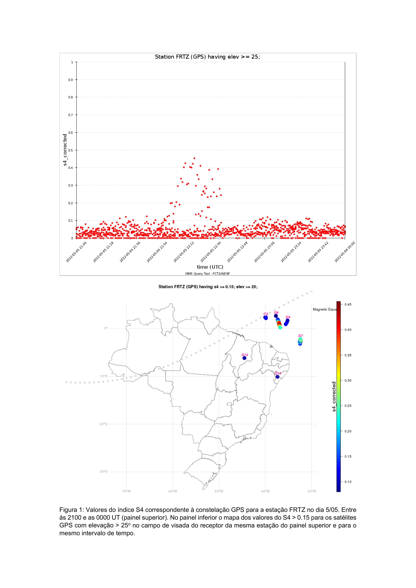
                        

