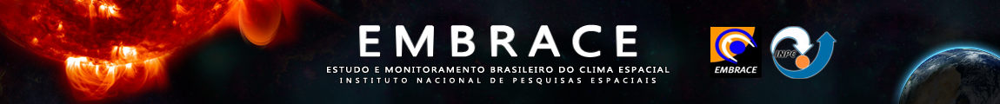

# Briefing Clima Espacial -- 23/05/2022 
 # Sol 
 ## Responsável: José Cecatto 

16/05 – Flare M2 e blecaute rádio; Vento solar rápido (<= 550 km/s); 1 CME p.t.c. para a Terra; 
17/05 – Flare M1; Vento solar rápido (< 600 km/s); 7 CME p.t.c. para a Terra; 
18/05 – Flare M1; Vento solar rápido (<= 550 km/s); 3 CME p.t.c. para a Terra;  
19/05 – 3 flare M (2M1, M6); Vento solar rápido (< 550 km/s); 7 CME p.t.c. para a Terra;  
20/05 – Flare M3; Vento solar rápido (< 600 km/s); 2 CME p.t.c. para a Terra; 
21/05 – Sem flare M/X; Vento solar rápido (<= 550 km/s); 8 CME p.t.c. para a Terra *; 
22/05 – Sem flare M/X; Vento solar rápido (<= 550 km/s); 9 CME p.t.c. para a Terra; 
23/05 – Sem flare M/X; Vento solar rápido (<= 550 km/s); 3 CME p.t.c. para a Terra; 
Prev.: Vento solar rápido até 24 de maio; relativamente baixa probabilidade de “flares” (40% M, 05% X) nos 
próximos 02 dias; eventualmente outras CME podem ter componente dirigida para a Terra. 
p.t.c. – pode(m) ter componente; * halo parcial; ** halo 

 ## Responsável: Douglas Silva 

* EMC (https://ccmc.gsfc.nasa.gov/donki/):
* WSA-ENLIL (Ejecoes de Massa Coronal (EMCs) 2022-05-17T05:48Z, 2022-05-17T06:48Z)
	 * Os resultados das simulacoes indicam que as bordas frontais combinada das EMCs alcancara a missao DSCOVR entre 2022-05-19T22:30Z e 2022-05-20T12:30Z.
* WSA-ENLIL (Ejecoes de Massa Coronal (EMCs) :2022-05-17T09:23Z)
	 * Os resultados das simulacoes indicam que o flanco da EMC alcancara a missao DSCOVR entre 2022-05-21T10:00Z e 2022-05-22T00:00Z. 

                        
                        # Ondas ULF 
 ## Responsável: José Paulo Marchezi 
 
*a) sinal do campo magnético total 
                              medido na Estação ISLL da rede CARISMA em cinza, 
                              junto com a flutuação na faixa de Pc5 em preto. b) 
                              Espectro de potência wavelet do sinal filtrado. c) 
                              Média da potência espectral nas faixas de 2 a 10 minutos 
                              (ondas ULF).*
                        *a) sinal do campo magnético total medido 
                              na Estação SMS da rede EMBRACE em cinza, junto com a 
                              flutuação na faixa de Pc5 em preto. b) Espectro de potência 
                              wavelet do sinal filtrado. c) Média da potência espectral nas 
                              faixas de 2 a 10 minutos (ondas ULF).*
                        *a) sinal do campo magnético total medido pelo 
                              satélite GOES 16, junto com a flutuação na faixa de Pc5 
                              em preto. b) Espectro de potência wavelet do sinal 
                              filtrado. c) Média da potência espectral nas faixas 
                              de 2 a 10 minutos (ondas ULF).*
                        A atividade de ondas ULF inicia no dia 16 de maio, apresenta dois picos de
curta duração antes das 12:00 UT e após o meio-dia se mantém com a
potência mais baixa com características de pulsações geomagnéticas
contínuas. No dia 17, por volta das 11:00 UT há um novo aumento do sinal,
com características contínuas, possivelmente relacionado a um aumento
da velocidade do vento solar. Entre os dias 18 e 19 a atividade se mantém
reduzida, com alguns picos, principalmente em altas latitudes, registradas
também pelo satélite GOES. As perturbações aumentam no dia 20 de maio,
registradas também em baixa latitude, pelos magnetômetros do EMBRACE.
Sumário
9/10
A atividade de ondas ULF inicia no dia 16 de maio, apresenta dois picos de curta duração antes das 12:00 UT e após o meio-dia se mantém com a potência mais baixa com características de pulsações geomagnéticas contínuas. No dia 17, por volta das 11:00 UT há um novo aumento do sinal, com características contínuas, possivelmente relacionado a um aumento da velocidade do vento solar. Entre os dias 18 e 19 a atividade se mantém reduzida, com alguns picos, principalmente em altas latitudes, registradas também pelo satélite GOES. As perturbações aumentam no dia 20 de maio, registradas também em baixa latitude, pelos magnetômetros do EMBRACE.# Ondas EMIC 
 ## Responsável: Claudia Medeiros 
 

                        # Geomagnetismo 
 ## Responsável: Livia Riveiro Alves 
 

                        
                        
                        
                        
                        
                        
                        
                        * Na semana de 17 a 23/05, destacam-se os seguintes eventos relacionados a atividade geomagnética:
* Os dados provenientes da rede de magnetômetros Embrace apresentaram instabilidades durante todo o período, sem eventos em destaque
* A atividade geomagnética foi instável durante todo o período, o índice AE apresentou aumento de atividade., com o índice Dst oscilando em torno de zero. O Kp mais alto da semana foi de 3+
*  A atividade auroral foi levemente intensificada nos dias 20 e 23/05.
* Campo magnético medido na órbita do satélite GOES apresentou algumas instabilidades
# Ionosfera 
 ## Responsável: Laysa Resende 
 
**Boa Vista: **

* Não ocorreu spread-F no dia 16.
* As camadas Es atingiu a escala 4 nos dias 18 e 21.

                        
**Cachoeira Paulista:**

* Ocorreu spread-F no dia 18.
* As camadas Es dessa região atingiu a escala 3 no dia 19.  

                        
**São Luís: **

* Ocorreu spread -F durante toda a semana. 
* As camadas Es dessa região atingiu a escala 4 no dia 21. 
* Ocorreu Blackout no dia 19.

                        
# Cintilação 
 ## Responsável: Siomel Savio Odriozola 
 
Neste reporte sobre o índice de cintilação S4, foram apresentados dados das 
estações SLMA em São Luiz/MA, STSN em Sinop/MG, STNT em Natal/BA e 
SJCE em São José dos Campos/SP. O índice S4 acompanha a presença de 
irregularidades na ionosfera quando elas têm uma escala espacial ~ 360 m.  
As estações SLMA, STSN e SJCE não apresentaram valores relevantes do 
índice S4 durante toda a semana. A estação STSN em Sinop, apresentou nos 
dias 18 e 19 de maio e no mesmo horário, valores do S4 próximo do 0.7. A Figura 
1 mostra o mapa com os satélites registrados por STSN no intervalo de tempo 
entre as 1200(UT) até as 1500(UT) no dia 19/05 (painel superior) e entre as 
1130(UT) até as 1500(UT) no dia 20/05 (painel inferior) e que forneceram valores 
do S4 > 0.2. O mesmo satélite (G9) aparece como único responsável pelo altos 
valores registrados neste intervalo de tempo o que indica uma causa extra 
geofísica nos altos valores do S4 em Sinop. 

                        

